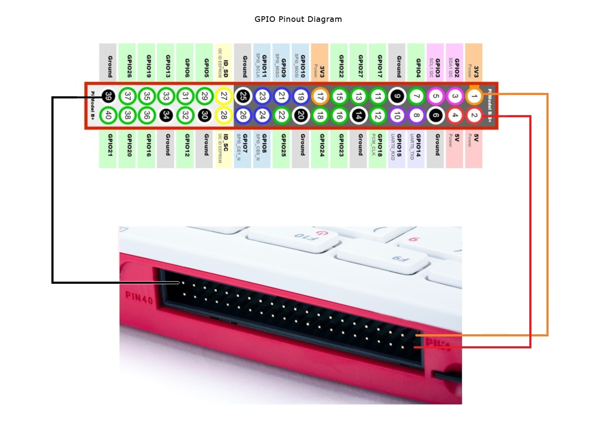
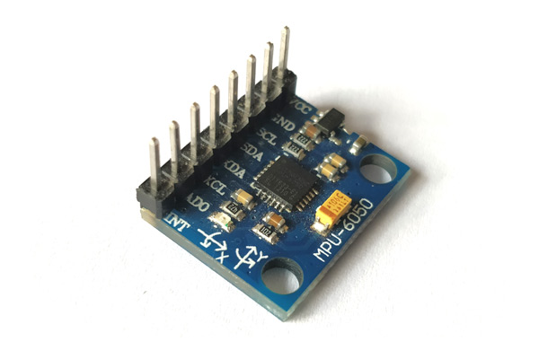

# Concussion Detection Sensor for Athlete Safety

**Using Technology and Faith to Protect God's Gift of Life**

---

## Table of Contents
1. [Introduction and Objective](#introduction-and-objective)  
2. [Materials](#materials)  
   - [Hardware](#hardware)  
   - [Software](#software)  
3. [Setup and Connections](#setup-and-connections)  
   - [Raspberry Pi <-> MPU-6050 Pinout](#raspberry-pi---mpu-6050-pinout)  
   - [Buzzer Pin Setup](#buzzer-pin-setup)  
   - [Additional Wiring Tips](#additional-wiring-tips)  
   - [Device Pinouts](#device-pinouts)  
4. [Software Installation](#software-installation)  
5. [Python Code for Live Logger](#python-code-for-live-logger)  
6. [How It Works](#how-it-works)  
7. [Catholic Values Integration](#catholic-values-integration)  
8. [Display Board and Presentation Script](#display-board-and-presentation-script)  
   - [Display Board Layout](#display-board-layout)  
   - [Presentation Script for JD](#presentation-script-for-jd)  
9. [Additional Resources](#additional-resources)  
10. [License](#license)

---

## Introduction and Objective
Concussions are a serious concern in sports. This project aims to design a **concussion detection sensor** prototype that can monitor impacts in sports and alert coaches to potential concussions. By using **historical data** to analyze trends, we can better understand when and how concussions occur and protect athletes more effectively.

This project integrates **Catholic values** of compassion, stewardship, and human dignity by emphasizing the responsibility to care for athletes’ well-being and by leveraging technology to safeguard the life that God has given.

---

## Materials

### Hardware
- Raspberry Pi 400 (or any compatible Raspberry Pi model)  
- MPU-6050 Accelerometer/Gyroscope Module  
- Buzzer (for audible alerts)  
- Breadboard and jumper wires  
- MicroSD card with Raspberry Pi OS  
- Helmet (for mounting the sensor)  
- Portable battery pack (to power the Raspberry Pi for portability)  
- Velcro or glue (for attaching the sensor to the helmet)  
- USB flash drive or cloud setup (to save historical data)

### Software
- Python libraries:
  - `smbus2`
  - `RPi.GPIO`
  - `matplotlib`
  - `pandas`
  - `datetime`

---

## Setup and Connections

### Raspberry Pi <-> MPU-6050 Pinout

| **Raspberry Pi Pin (Physical #)** | **BCM GPIO** | **MPU-6050 Pin** | **Description**                                                     |
|:---------------------------------:|:-----------:|:---------------:|---------------------------------------------------------------------|
| **Pin 1**                         | 3V3 Power   | **VCC**          | Power to the MPU-6050 (3.3V) <br> *Check if your module can accept 5V*  |
| **Pin 3**                         | GPIO2 (SDA) | **SDA**          | I2C Data Line                                                        |
| **Pin 5**                         | GPIO3 (SCL) | **SCL**          | I2C Clock Line                                                       |
| **Pin 6**                         | GND         | **GND**          | Ground reference                                                     |

> **Note**: Some MPU-6050 boards have onboard voltage regulators, allowing 5V input on VCC.  
> Always confirm the acceptable voltage input for your specific module.

#### Optional Pins
- **INT (Interrupt)** on the MPU-6050 can be connected to any free GPIO pin on the Raspberry Pi if you want to use interrupt-driven events (e.g., GPIO4, GPIO17). This is not required for basic polling or simple I2C reads.

### Buzzer Pin Setup
If you are using a buzzer for impact alerts, wire it as follows:

| **Raspberry Pi Pin (Physical #)** | **BCM GPIO** | **Buzzer Pin** | **Description**              |
|:---------------------------------:|:-----------:|:--------------:|------------------------------|
| **Pin 11**                        | GPIO17       | **+** (Buzzer) | Positive leg of the buzzer   |
| **Any GND** pin (e.g. Pin 6)      | GND          | **-** (Buzzer) | Ground leg of the buzzer     |

> **Note**: If your buzzer requires more current than the GPIO pin can safely supply, use a transistor driver circuit with an appropriate resistor rather than driving the buzzer directly from the GPIO.

### Additional Wiring Tips
1. **I2C Interface**: Make sure I2C is enabled on the Raspberry Pi (via `sudo raspi-config` -> *Interfacing Options* -> *I2C* -> *Enable*).  
2. **Pull-Up Resistors**: Many MPU-6050 breakout boards include pull-up resistors on SDA and SCL. If yours does not, you may need to add external pull-up resistors (typically 4.7kΩ) to 3.3V.  
3. **Voltage Levels**: If the MPU-6050 board lacks level shifting or regulators, use only 3.3V to avoid damaging the sensor.  
4. **Buzzer Requirements**: If you have a passive buzzer or one that draws more current than the GPIO can provide, use a transistor or MOSFET with a diode and appropriate resistor.


## Device Pinouts

| [](rPi400Pinout-3a.png) |
|:--------------------------------------------------------------------------------------------------------------:|
| **Pi 400 Pinout**                                                                                             |
<details>
  <summary>#### Pi 400 Full 40-Pin GPIO Header</summary>

Below is the complete 40-pin layout for the Pi 400 (which matches the Raspberry Pi 4 pinout).  
Columns include **Physical Pin #**, **BCM GPIO** numbering, **Name/Function**, and a brief **Description**.

| **Physical Pin #** | **BCM GPIO** | **Name / Function** | **Description**                                                                       |
|:------------------:|:-----------:|:-------------------:|:--------------------------------------------------------------------------------------|
| 1                  | 3V3 Power   | 3.3V               | **3.3V Power Supply** for low-voltage components.                                    |
| 2                  | 5V          | 5V                 | **5V Power Supply** (direct from USB-C power in).                                    |
| 3                  | GPIO2       | SDA                | **I2C Data Line** (default).                                                         |
| 4                  | 5V          | 5V                 | **5V Power Supply** (direct from USB-C power in).                                    |
| 5                  | GPIO3       | SCL                | **I2C Clock Line** (default).                                                        |
| 6                  | GND         | Ground             | **Common Ground Reference**.                                                         |
| 7                  | GPIO4       | GPCLK0             | General-purpose clock pin (also used for 1-Wire with config changes).               |
| 8                  | GPIO14      | TXD                | **UART TX** pin (transmit).                                                          |
| 9                  | GND         | Ground             | **Common Ground Reference**.                                                         |
| 10                 | GPIO15      | RXD                | **UART RX** pin (receive).                                                           |
| 11                 | GPIO17      | GPIO17             | General-purpose I/O. Often used for LED or buzzer.                                   |
| 12                 | GPIO18      | PCM_CLK            | PCM/I2S clock or general-purpose I/O.                                                |
| 13                 | GPIO27      | GPIO27             | General-purpose I/O.                                                                 |
| 14                 | GND         | Ground             | **Common Ground Reference**.                                                         |
| 15                 | GPIO22      | GPIO22             | General-purpose I/O.                                                                 |
| 16                 | GPIO23      | GPIO23             | General-purpose I/O.                                                                 |
| 17                 | 3V3 Power   | 3.3V               | **3.3V Power Supply** (another 3.3V rail).                                           |
| 18                 | GPIO24      | GPIO24             | General-purpose I/O.                                                                 |
| 19                 | GPIO10      | MOSI               | **SPI MOSI** (Master Out, Slave In).                                                 |
| 20                 | GND         | Ground             | **Common Ground Reference**.                                                         |
| 21                 | GPIO9       | MISO               | **SPI MISO** (Master In, Slave Out).                                                 |
| 22                 | GPIO25      | GPIO25             | General-purpose I/O.                                                                 |
| 23                 | GPIO11      | SCLK               | **SPI Serial Clock**.                                                                |
| 24                 | GPIO8       | CE0                | **SPI Chip Enable 0**.                                                               |
| 25                 | GND         | Ground             | **Common Ground Reference**.                                                         |
| 26                 | GPIO7       | CE1                | **SPI Chip Enable 1**.                                                               |
| 27                 | GPIO0       | ID_SD              | **ID EEPROM Data** (used internally for HAT identification).                         |
| 28                 | GPIO1       | ID_SC              | **ID EEPROM Clock** (used internally for HAT identification).                        |
| 29                 | GPIO5       | GPIO5              | General-purpose I/O.                                                                 |
| 30                 | GND         | Ground             | **Common Ground Reference**.                                                         |
| 31                 | GPIO6       | GPIO6              | General-purpose I/O.                                                                 |
| 32                 | GPIO12      | GPIO12             | General-purpose I/O, also PWM channel 0, etc.                                        |
| 33                 | GPIO13      | GPIO13             | General-purpose I/O, also PWM channel 1, etc.                                        |
| 34                 | GND         | Ground             | **Common Ground Reference**.                                                         |
| 35                 | GPIO19      | GPIO19             | General-purpose I/O, I2S word select (PCM_FS), etc.                                  |
| 36                 | GPIO16      | GPIO16             | General-purpose I/O.                                                                 |
| 37                 | GPIO26      | GPIO26             | General-purpose I/O.                                                                 |
| 38                 | GPIO20      | GPIO20             | General-purpose I/O.                                                                 |
| 39                 | GND         | Ground             | **Common Ground Reference**.                                                         |
| 40                 | GPIO21      | GPIO21             | General-purpose I/O.                                                                 |

> **Notes**:  
> - The BCM GPIO numbers (e.g., GPIO2, GPIO3, etc.) are commonly used in Python with libraries like `RPi.GPIO`.  
> - Pins 27 (ID_SD) and 28 (ID_SC) are reserved for HAT identification and should generally be left unused unless you’re designing a custom HAT with its own ID EEPROM.  
> - Always verify power pins (3.3V and 5V) before making connections to ensure proper voltage levels for your devices.  
> - For more detailed information, consult the [official Raspberry Pi documentation](https://www.raspberrypi.com/documentation/).
</details>

| [](MPU6050-Module.jpg) | [](MPU6050-Pinout.png) |
|:--------------------------------------------------------------------------------------------------------------:|:--------------------------------------------------------------------------------------------------------------:|
| **MPU6050 Module**                                                                                            | **MPU6050 Pinout**                                                                                             |

<details>
  <summary>#### MPU6050 Pinout Configuration</summary>
  
| Pin Number | Pin Name              | Description                                                                  |
|------------|-----------------------|------------------------------------------------------------------------------|
| 1          | Vcc                   | Provides power to the module (3V-5V). Typically +5V is used.                 |
| 2          | Ground                | Connected to system ground                                                   |
| 3          | Serial Clock (SCL)    | Provides clock pulses for I2C communication                                  |
| 4          | Serial Data (SDA)     | Transfers data via I2C                                                       |
| 5          | Aux Serial Data (XDA) | Can interface additional I2C modules (optional)                              |
| 6          | Aux Serial Clock (XCL)| Can interface additional I2C modules (optional)                              |
| 7          | AD0                   | Used to vary the address if multiple MPU6050s share the same I2C bus         |
| 8          | Interrupt (INT)       | Signals when data is ready for the MCU to read                               |
</details>

---

## Software Installation

1. **Update and Upgrade the System**  
   ``` bash
   sudo apt-get update
   sudo apt-get upgrade -y
   ```

2. **Install Python and Libraries**  
   ``` bash

   sudo apt-get update
   sudo apt-get install -y python3-smbus python3-rpi.gpio python3-pandas python3-matplotlib python3-numpy

   sudo apt-get install -y python3-pip python3-dev
   sudo apt-get install -y python3-smbus2  # For I2C communication with MPU-6050
   sudo apt-get install -y python3-RPi.GPIO
   sudo apt-get install -y python3-pandas
   sudo apt-get install -y python3-matplotlib
   sudo apt-get install -y python3-numpy    # Optional for advanced data processing
   ```

3. **Install I2C Tools**  
   ``` bash
   sudo apt-get install -y i2c-tools
   ```

4. **Enable the I2C Interface**  
   - Run the configuration tool:  
     ``` bash
     sudo raspi-config
     ```  
   - Go to **Interface Options** -> **I2C** -> **Enable**.  
   - Reboot the Pi:  
     ``` bash
     sudo reboot
     ```  

5. **Verify the Installation**  
   ``` bash
   ls /dev/i2c*
   sudo i2cdetect -y 1
   ```

   The MPU-6050 sensor should appear at address `0x68`.

---

## Python Code for Live Logger
``` python
#!/usr/bin/env python3
"""
Helmet Tap Detection with MPU6050 Sensor and Real-Time Graphing
===============================================================
This program detects taps on a helmet using the MPU6050 sensor and displays real-time graphs
of high-pass filtered acceleration values.

Features:
- Tap detection based on high-pass filtered acceleration.
- Real-time graphing of filtered acceleration values.
- Records and prints the top 10 maximum hits with timestamps.

Press Ctrl+C to stop the program.
"""

import smbus
import time
import RPi.GPIO as GPIO
from datetime import datetime
import matplotlib.pyplot as plt
import matplotlib.animation as animation

# -------------------------------------------------------------------------
#                1. CONSTANTS AND SETTINGS
# -------------------------------------------------------------------------
# Graph-related variables
GRAPH_MAIN_TITLE = "Athlete Helmet Safety Sensor"  # Main title of the graph
GRAPH_SUBTITLE = "Real-Time Concussion Detection with Technology and Faith"  # Subtitle of the graph
X_AXIS_LABEL = "Time (s)"  # X-axis label
Y_AXIS_LABEL = "Acceleration (g)"  # Y-axis label
LEGEND_TITLE = "Legend"  # Legend title
TOP_HITS_LABEL = "Top Hits:\n"  # Label for the top hits section
GRAPH_Y_LIMITS = (-15, 15)  # Fixed Y-axis limits
GRAPH_WINDOW_SIZE = 100  # Number of data points displayed in the graph window
NUM_TOP_HITS = 5  # Number of top hits to display in the graph
GRAPH_TITLE_FONT_SIZE = 14  # Font size for the main title
GRAPH_SUBTITLE_FONT_SIZE = 10  # Font size for the subtitle

# Numerical Constants
USE_BUZZER = False
DEBUG = False
BUZZER_PIN = 17  # GPIO pin for buzzer
MPU_ADDRESS = 0x68  # I2C address of the MPU6050 sensor
TAP_THRESHOLD_G = 2.0  # Threshold in g-forces for a tap
COOLDOWN_SECONDS = 0.5  # Cooldown period after a tap detection
SAMPLE_RATE_HZ = 100  # Data sampling rate in Hz
HIGH_PASS_ALPHA = 0.85  # High-pass filter coefficient (0.8–0.99)
CALIBRATION_SAMPLES = 100  # Number of samples for sensor calibration
BEEP_DURATION = 0.2  # Duration of buzzer beep in seconds

# -------------------------------------------------------------------------
#                2. INITIALIZATION
# -------------------------------------------------------------------------
# Set up the buzzer
if USE_BUZZER:
    GPIO.setmode(GPIO.BCM)
    GPIO.setup(BUZZER_PIN, GPIO.OUT)

# Initialize the I2C bus
bus = smbus.SMBus(1)

def read_raw_data(register_address):
    """
    Reads raw 16-bit data from the MPU6050 sensor.
    """
    high_byte = bus.read_byte_data(MPU_ADDRESS, register_address)
    low_byte = bus.read_byte_data(MPU_ADDRESS, register_address + 1)
    value = (high_byte << 8) | low_byte
    if value > 32768:
        value -= 65536
    return value

# Wake up the sensor and configure sensitivity
bus.write_byte_data(MPU_ADDRESS, 0x6B, 0)  # Wake up the MPU6050
bus.write_byte_data(MPU_ADDRESS, 0x1C, 0x18)  # Set accelerometer range to ±16g

# Calibration offsets
acc_offset_x = 0
acc_offset_y = 0
acc_offset_z = 0

def calibrate_sensor():
    """Calibrates the MPU6050 to determine acceleration offsets."""
    global acc_offset_x, acc_offset_y, acc_offset_z
    if DEBUG:
        print("Calibrating sensor...")
    acc_x, acc_y, acc_z = 0, 0, 0
    for _ in range(CALIBRATION_SAMPLES):
        acc_x += read_raw_data(0x3B)
        acc_y += read_raw_data(0x3D)
        acc_z += read_raw_data(0x3F)
        time.sleep(1 / SAMPLE_RATE_HZ)
    acc_offset_x = acc_x / CALIBRATION_SAMPLES
    acc_offset_y = acc_y / CALIBRATION_SAMPLES
    acc_offset_z = acc_z / CALIBRATION_SAMPLES
    if DEBUG:
        print(f"Calibration complete: Offsets -> X: {acc_offset_x}, Y: {acc_offset_y}, Z: {acc_offset_z}")

calibrate_sensor()

# High-pass filter states
last_acc_x = 0
last_acc_y = 0
last_acc_z = 0

# Timestamp of the last detected tap
last_tap_time = 0

# Graph data buffers
x_vals = []
acc_x_vals = []
acc_y_vals = []
acc_z_vals = []

# List to store maximum hits
max_hits = []

def high_pass_filter(new_value, last_value):
    """
    Applies a high-pass filter to isolate high-frequency changes (like taps).
    """
    return HIGH_PASS_ALPHA * (last_value + new_value - last_value)

def detect_tap():
    """
    Reads acceleration data, applies a high-pass filter, checks for taps, 
    and updates graph data.
    """
    global last_acc_x, last_acc_y, last_acc_z, last_tap_time

    # Read raw acceleration data
    raw_x = read_raw_data(0x3B) - acc_offset_x
    raw_y = read_raw_data(0x3D) - acc_offset_y
    raw_z = read_raw_data(0x3F) - acc_offset_z

    # Convert to g-forces
    acc_x_g = raw_x / 2048.0  # Sensitivity for ±16g is 2048 LSB/g
    acc_y_g = raw_y / 2048.0
    acc_z_g = raw_z / 2048.0

    # Apply high-pass filter
    acc_x_filtered = high_pass_filter(acc_x_g, last_acc_x)
    acc_y_filtered = high_pass_filter(acc_y_g, last_acc_y)
    acc_z_filtered = high_pass_filter(acc_z_g, last_acc_z)

    # Update last values
    last_acc_x = acc_x_filtered
    last_acc_y = acc_y_filtered
    last_acc_z = acc_z_filtered

    # Compute magnitude of filtered acceleration
    acc_magnitude = (acc_x_filtered**2 + acc_y_filtered**2 + acc_z_filtered**2) ** 0.5

    # Get current time
    current_time = time.time()
    timestamp = datetime.now().strftime("%Y-%m-%d %H:%M:%S")

    # Update graph data
    x_vals.append(current_time)
    acc_x_vals.append(acc_x_filtered)
    acc_y_vals.append(acc_y_filtered)
    acc_z_vals.append(acc_z_filtered)

    # Trim graph data to window size
    x_vals[:] = x_vals[-GRAPH_WINDOW_SIZE:]
    acc_x_vals[:] = acc_x_vals[-GRAPH_WINDOW_SIZE:]
    acc_y_vals[:] = acc_y_vals[-GRAPH_WINDOW_SIZE:]
    acc_z_vals[:] = acc_z_vals[-GRAPH_WINDOW_SIZE:]

    # Check for a tap
    if acc_magnitude > TAP_THRESHOLD_G and (current_time - last_tap_time > COOLDOWN_SECONDS):
        last_tap_time = current_time
        print(f"Tap detected! Magnitude: {acc_magnitude:.2f}g at {timestamp}")
        max_hits.append((timestamp, acc_magnitude))
        if USE_BUZZER:
            GPIO.output(BUZZER_PIN, GPIO.HIGH)
            time.sleep(BEEP_DURATION)
            GPIO.output(BUZZER_PIN, GPIO.LOW)

    # Debug output
    if DEBUG:
        print(f"Raw Acceleration: X={acc_x_g:.2f}g, Y={acc_y_g:.2f}g, Z={acc_z_g:.2f}g")
        print(f"Filtered Acc: X={acc_x_filtered:.2f}g, Y={acc_y_filtered:.2f}g, Z={acc_z_filtered:.2f}g, Magnitude={acc_magnitude:.2f}g")

# -------------------------------------------------------------------------
#                3. LIVE GRAPHING
# -------------------------------------------------------------------------
fig, ax = plt.subplots()

# Define the graph lines
line_x, = ax.plot([], [], label="G-force X", color="blue")
line_y, = ax.plot([], [], label="G-force Y", color="green")
line_z, = ax.plot([], [], label="G-force Z", color="red")

# Set titles and labels
ax.set_title(GRAPH_MAIN_TITLE, fontsize=GRAPH_TITLE_FONT_SIZE)
fig.suptitle(GRAPH_SUBTITLE, fontsize=GRAPH_SUBTITLE_FONT_SIZE)
ax.set_xlabel(X_AXIS_LABEL)
ax.set_ylabel(Y_AXIS_LABEL)
ax.legend(title=LEGEND_TITLE, loc="upper right")
ax.grid(True)
ax.set_ylim(GRAPH_Y_LIMITS)

# Text box for displaying top hits
top_hits_text = ax.text(0.02, 0.95, "", transform=ax.transAxes, fontsize=10,
                        verticalalignment="top", horizontalalignment="left")

def init_graph():
    """Initialize the graph with empty data."""
    line_x.set_data([], [])
    line_y.set_data([], [])
    line_z.set_data([], [])
    top_hits_text.set_text("")  # Clear the top hits text box
    return line_x, line_y, line_z, top_hits_text

def update_graph(frame):
    """Update the graph with new filtered data and show top hits."""
    detect_tap()

    # Update graph lines
    line_x.set_data(x_vals, acc_x_vals)
    line_y.set_data(x_vals, acc_y_vals)
    line_z.set_data(x_vals, acc_z_vals)

    # Show the last 10 seconds on the x-axis
    if x_vals:
        ax.set_xlim(max(x_vals[-1] - 10, x_vals[0]), x_vals[-1])

    # Update the top hits text box
    max_hits.sort(key=lambda x: x[1], reverse=True)  # Sort by magnitude, descending
    top_hits_display = "\n".join([f"{t[0]}: {t[1]:.2f}g" for t in max_hits[:NUM_TOP_HITS]])
    top_hits_text.set_text(f"{TOP_HITS_LABEL}{top_hits_display}")

    return line_x, line_y, line_z, top_hits_text

ani = animation.FuncAnimation(fig, update_graph, init_func=init_graph, interval=1000 / SAMPLE_RATE_HZ, blit=True)

# -------------------------------------------------------------------------
#                4. MAIN PROGRAM
# -------------------------------------------------------------------------
try:
    print("Starting helmet tap detection with graphing... Press Ctrl+C to stop.")
    plt.show()
except KeyboardInterrupt:
    print("\nProgram interrupted by user. Exiting...")
finally:
    if USE_BUZZER:
        GPIO.cleanup()
    max_hits.sort(key=lambda x: x[1], reverse=True)
    print("\nTop 10 Maximum Hits:")
    print("{:<20} {}".format("Timestamp", "Magnitude (g)"))
    for timestamp, magnitude in max_hits[:10]:
        print(f"{timestamp:<20} {magnitude:.2f}")
```

---

## How It Works
1. The **MPU-6050 accelerometer** measures acceleration forces and sends data to the Raspberry Pi over the I2C bus.  
2. If the measured force exceeds the defined **IMPACT_THRESHOLD**, the buzzer is triggered to alert coaches and staff.  
3. Data is logged into a CSV file (`impact_data.csv`), and a graph is generated upon exit to visualize impact trends over time.

---

## Catholic Values Integration
- **Care for Others:** Reflects compassion for athletes by prioritizing their safety and well-being.  
- **Stewardship:** Demonstrates the responsible use of technology, a gift from God, to serve others.  
- **Human Dignity:** Emphasizes protecting the athlete’s body, honoring the belief that our bodies are temples of the Holy Spirit.

> *"Do you not know that your body is a temple of the Holy Spirit within you?"*  
> — 1 Corinthians 6:19

---

## Display Board and Presentation Script

### Display Board Layout
1. **Title Section**  
   - Title: “Concussion Detection Sensor for Athlete Safety”  
   - Tagline: *Using Technology and Faith to Protect God’s Gift of Life*

2. **Left Panel**  
   - Describe the problem of concussions in sports and the project’s objective.

3. **Center Panel**  
   - Show a visual diagram of the setup (Raspberry Pi, accelerometer, buzzer).  
   - Add a flowchart to explain how the system monitors impacts.  
   - Insert graphs displaying sample impact data.

4. **Right Panel**  
   - Highlight Catholic values with relevant quotes.  
   - Discuss broader implications and future improvements.

5. **Interactive Section**  
   - Live demonstration (if possible) or a QR code linking to a video demonstration.

### Presentation Script for JD
1. **Introduction**  
   - Briefly explain the problem of concussions in sports and why this project is important.  
   - Connect the project to Catholic values (care for others, stewardship, and human dignity).

2. **Demonstration**  
   - Show the prototype in action. Simulate an impact to trigger the buzzer alert.

3. **Discussion**  
   - Present how the collected data (from `%date%_impact_data.csv`) is visualized.  
   - Emphasize patterns or trends in the data that can help prevent future injuries.

---

## Additional Resources
- [Raspberry Pi Official Documentation](https://www.raspberrypi.com/documentation/)  
- [MPU-6050 Product Page](https://www.invensense.com/products/motion-tracking/6-axis/mpu-6050/)  
- [Pandas Documentation](https://pandas.pydata.org/docs/)  
- [Matplotlib Documentation](https://matplotlib.org/stable/contents.html)

---

## License
This project is open-source and available under the **MIT License**. Feel free to modify and distribute for educational or personal use.
