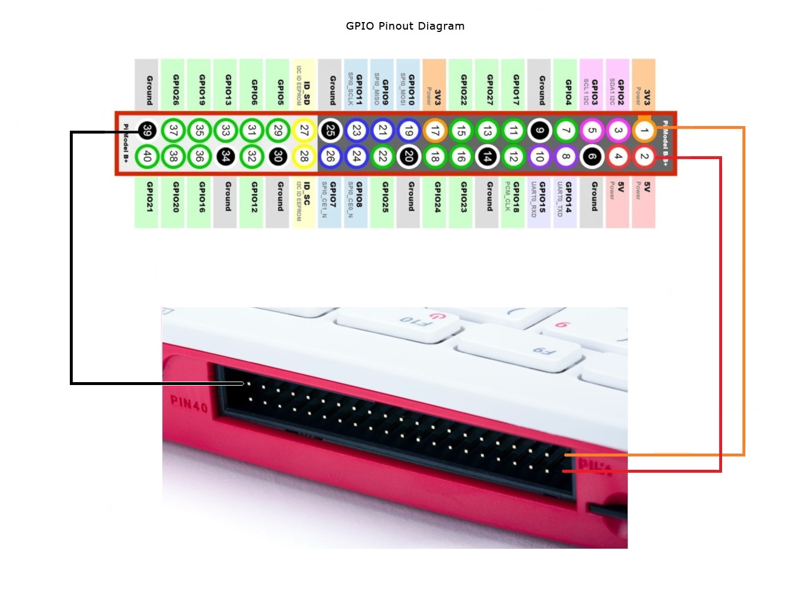

# Concussion Detection Sensor for Athlete Safety

**Using Technology and Faith to Protect God's Gift of Life**

---

## Table of Contents
1. [Introduction and Objective](#introduction-and-objective)  
2. [Materials](#materials)  
   - [Hardware](#hardware)  
   - [Software](#software)  
3. [Setup and Connections](#setup-and-connections)  
   - [Raspberry Pi <-> MPU-6050 Pinout](#raspberry-pi---mpu-6050-pinout)  
   - [Buzzer Pin Setup](#buzzer-pin-setup)  
   - [Additional Wiring Tips](#additional-wiring-tips)  
   - [Device Pinouts](#device-pinouts)  
4. [Software Installation](#software-installation)  
5. [Python Code for Delayed Logger](#python-code-for-delayed-logger)  
6. [Python Code for Live Logger](#python-code-for-live-logger)  
7. [How It Works](#how-it-works)  
8. [Catholic Values Integration](#catholic-values-integration)  
9. [Display Board and Presentation Script](#display-board-and-presentation-script)  
   - [Display Board Layout](#display-board-layout)  
   - [Presentation Script for JD](#presentation-script-for-jd)  
10. [Additional Resources](#additional-resources)  
11. [License](#license)

---

## Introduction and Objective
Concussions are a serious concern in sports. This project aims to design a **concussion detection sensor** prototype that can monitor impacts in sports and alert coaches to potential concussions. By using **historical data** to analyze trends, we can better understand when and how concussions occur and protect athletes more effectively.

This project integrates **Catholic values** of compassion, stewardship, and human dignity by emphasizing the responsibility to care for athletes’ well-being and by leveraging technology to safeguard the life that God has given.

---

## Materials

### Hardware
- Raspberry Pi 400 (or any compatible Raspberry Pi model)  
- MPU-6050 Accelerometer/Gyroscope Module  
- Buzzer (for audible alerts)  
- Breadboard and jumper wires  
- MicroSD card with Raspberry Pi OS  
- Helmet (for mounting the sensor)  
- Portable battery pack (to power the Raspberry Pi for portability)  
- Velcro or glue (for attaching the sensor to the helmet)  
- USB flash drive or cloud setup (to save historical data)

### Software
- Python libraries:
  - `smbus2`
  - `RPi.GPIO`
  - `matplotlib`
  - `pandas`
  - `datetime`

---

## Setup and Connections

### Raspberry Pi <-> MPU-6050 Pinout

| **Raspberry Pi Pin (Physical #)** | **BCM GPIO** | **MPU-6050 Pin** | **Description**                                                     |
|:---------------------------------:|:-----------:|:---------------:|---------------------------------------------------------------------|
| **Pin 1**                         | 3V3 Power   | **VCC**          | Power to the MPU-6050 (3.3V) <br> *Check if your module can accept 5V*  |
| **Pin 3**                         | GPIO2 (SDA) | **SDA**          | I2C Data Line                                                        |
| **Pin 5**                         | GPIO3 (SCL) | **SCL**          | I2C Clock Line                                                       |
| **Pin 6**                         | GND         | **GND**          | Ground reference                                                     |

> **Note**: Some MPU-6050 boards have onboard voltage regulators, allowing 5V input on VCC.  
> Always confirm the acceptable voltage input for your specific module.

#### Optional Pins
- **INT (Interrupt)** on the MPU-6050 can be connected to any free GPIO pin on the Raspberry Pi if you want to use interrupt-driven events (e.g., GPIO4, GPIO17). This is not required for basic polling or simple I2C reads.

### Buzzer Pin Setup
If you are using a buzzer for impact alerts, wire it as follows:

| **Raspberry Pi Pin (Physical #)** | **BCM GPIO** | **Buzzer Pin** | **Description**              |
|:---------------------------------:|:-----------:|:--------------:|------------------------------|
| **Pin 11**                        | GPIO17       | **+** (Buzzer) | Positive leg of the buzzer   |
| **Any GND** pin (e.g. Pin 6)      | GND          | **-** (Buzzer) | Ground leg of the buzzer     |

> **Note**: If your buzzer requires more current than the GPIO pin can safely supply, use a transistor driver circuit with an appropriate resistor rather than driving the buzzer directly from the GPIO.

### Additional Wiring Tips
1. **I2C Interface**: Make sure I2C is enabled on the Raspberry Pi (via `sudo raspi-config` -> *Interfacing Options* -> *I2C* -> *Enable*).  
2. **Pull-Up Resistors**: Many MPU-6050 breakout boards include pull-up resistors on SDA and SCL. If yours does not, you may need to add external pull-up resistors (typically 4.7kΩ) to 3.3V.  
3. **Voltage Levels**: If the MPU-6050 board lacks level shifting or regulators, use only 3.3V to avoid damaging the sensor.  
4. **Buzzer Requirements**: If you have a passive buzzer or one that draws more current than the GPIO can provide, use a transistor or MOSFET with a diode and appropriate resistor.


## Device Pinouts

| [](rPi400Pinout-3a.png) |
|:--------------------------------------------------------------------------------------------------------------:|
| **Pi 400 Pinout**                                                                                             |

#### Pi 400 Full 40-Pin GPIO Header

Below is the complete 40-pin layout for the Pi 400 (which matches the Raspberry Pi 4 pinout).  
Columns include **Physical Pin #**, **BCM GPIO** numbering, **Name/Function**, and a brief **Description**.

| **Physical Pin #** | **BCM GPIO** | **Name / Function** | **Description**                                                                       |
|:------------------:|:-----------:|:-------------------:|:--------------------------------------------------------------------------------------|
| 1                  | 3V3 Power   | 3.3V               | **3.3V Power Supply** for low-voltage components.                                    |
| 2                  | 5V          | 5V                 | **5V Power Supply** (direct from USB-C power in).                                    |
| 3                  | GPIO2       | SDA                | **I2C Data Line** (default).                                                         |
| 4                  | 5V          | 5V                 | **5V Power Supply** (direct from USB-C power in).                                    |
| 5                  | GPIO3       | SCL                | **I2C Clock Line** (default).                                                        |
| 6                  | GND         | Ground             | **Common Ground Reference**.                                                         |
| 7                  | GPIO4       | GPCLK0             | General-purpose clock pin (also used for 1-Wire with config changes).               |
| 8                  | GPIO14      | TXD                | **UART TX** pin (transmit).                                                          |
| 9                  | GND         | Ground             | **Common Ground Reference**.                                                         |
| 10                 | GPIO15      | RXD                | **UART RX** pin (receive).                                                           |
| 11                 | GPIO17      | GPIO17             | General-purpose I/O. Often used for LED or buzzer.                                   |
| 12                 | GPIO18      | PCM_CLK            | PCM/I2S clock or general-purpose I/O.                                                |
| 13                 | GPIO27      | GPIO27             | General-purpose I/O.                                                                 |
| 14                 | GND         | Ground             | **Common Ground Reference**.                                                         |
| 15                 | GPIO22      | GPIO22             | General-purpose I/O.                                                                 |
| 16                 | GPIO23      | GPIO23             | General-purpose I/O.                                                                 |
| 17                 | 3V3 Power   | 3.3V               | **3.3V Power Supply** (another 3.3V rail).                                           |
| 18                 | GPIO24      | GPIO24             | General-purpose I/O.                                                                 |
| 19                 | GPIO10      | MOSI               | **SPI MOSI** (Master Out, Slave In).                                                 |
| 20                 | GND         | Ground             | **Common Ground Reference**.                                                         |
| 21                 | GPIO9       | MISO               | **SPI MISO** (Master In, Slave Out).                                                 |
| 22                 | GPIO25      | GPIO25             | General-purpose I/O.                                                                 |
| 23                 | GPIO11      | SCLK               | **SPI Serial Clock**.                                                                |
| 24                 | GPIO8       | CE0                | **SPI Chip Enable 0**.                                                               |
| 25                 | GND         | Ground             | **Common Ground Reference**.                                                         |
| 26                 | GPIO7       | CE1                | **SPI Chip Enable 1**.                                                               |
| 27                 | GPIO0       | ID_SD              | **ID EEPROM Data** (used internally for HAT identification).                         |
| 28                 | GPIO1       | ID_SC              | **ID EEPROM Clock** (used internally for HAT identification).                        |
| 29                 | GPIO5       | GPIO5              | General-purpose I/O.                                                                 |
| 30                 | GND         | Ground             | **Common Ground Reference**.                                                         |
| 31                 | GPIO6       | GPIO6              | General-purpose I/O.                                                                 |
| 32                 | GPIO12      | GPIO12             | General-purpose I/O, also PWM channel 0, etc.                                        |
| 33                 | GPIO13      | GPIO13             | General-purpose I/O, also PWM channel 1, etc.                                        |
| 34                 | GND         | Ground             | **Common Ground Reference**.                                                         |
| 35                 | GPIO19      | GPIO19             | General-purpose I/O, I2S word select (PCM_FS), etc.                                  |
| 36                 | GPIO16      | GPIO16             | General-purpose I/O.                                                                 |
| 37                 | GPIO26      | GPIO26             | General-purpose I/O.                                                                 |
| 38                 | GPIO20      | GPIO20             | General-purpose I/O.                                                                 |
| 39                 | GND         | Ground             | **Common Ground Reference**.                                                         |
| 40                 | GPIO21      | GPIO21             | General-purpose I/O.                                                                 |

> **Notes**:  
> - The BCM GPIO numbers (e.g., GPIO2, GPIO3, etc.) are commonly used in Python with libraries like `RPi.GPIO`.  
> - Pins 27 (ID_SD) and 28 (ID_SC) are reserved for HAT identification and should generally be left unused unless you’re designing a custom HAT with its own ID EEPROM.  
> - Always verify power pins (3.3V and 5V) before making connections to ensure proper voltage levels for your devices.  
> - For more detailed information, consult the [official Raspberry Pi documentation](https://www.raspberrypi.com/documentation/).


| [](MPU6050-Module.jpg) | [](MPU6050-Pinout.png) |
|:--------------------------------------------------------------------------------------------------------------:|:--------------------------------------------------------------------------------------------------------------:|
| **MPU6050 Module**                                                                                            | **MPU6050 Pinout**                                                                                             |

#### MPU6050 Pinout Configuration
| Pin Number | Pin Name              | Description                                                                  |
|------------|-----------------------|------------------------------------------------------------------------------|
| 1          | Vcc                   | Provides power to the module (3V-5V). Typically +5V is used.                 |
| 2          | Ground                | Connected to system ground                                                   |
| 3          | Serial Clock (SCL)    | Provides clock pulses for I2C communication                                  |
| 4          | Serial Data (SDA)     | Transfers data via I2C                                                       |
| 5          | Aux Serial Data (XDA) | Can interface additional I2C modules (optional)                              |
| 6          | Aux Serial Clock (XCL)| Can interface additional I2C modules (optional)                              |
| 7          | AD0                   | Used to vary the address if multiple MPU6050s share the same I2C bus         |
| 8          | Interrupt (INT)       | Signals when data is ready for the MCU to read                               |

---

## Software Installation

1. **Update and Upgrade the System**  
   ``` bash
   sudo apt-get update
   sudo apt-get upgrade -y
   ```

2. **Install Python and Libraries**  
   ``` bash

   sudo apt-get update
   sudo apt-get install -y python3-smbus python3-rpi.gpio python3-pandas python3-matplotlib python3-numpy

   sudo apt-get install -y python3-pip python3-dev
   sudo apt-get install -y python3-smbus2  # For I2C communication with MPU-6050
   sudo apt-get install -y python3-RPi.GPIO
   sudo apt-get install -y python3-pandas
   sudo apt-get install -y python3-matplotlib
   sudo apt-get install -y python3-numpy    # Optional for advanced data processing
   ```

3. **Install I2C Tools**  
   ``` bash
   sudo apt-get install -y i2c-tools
   ```

4. **Enable the I2C Interface**  
   - Run the configuration tool:  
     ``` bash
     sudo raspi-config
     ```  
   - Go to **Interface Options** -> **I2C** -> **Enable**.  
   - Reboot the Pi:  
     ``` bash
     sudo reboot
     ```  

5. **Verify the Installation**  
   ``` bash
   ls /dev/i2c*
   sudo i2cdetect -y 1
   ```

   The MPU-6050 sensor should appear at address `0x68`.

---

## Python Code for Delayed Logger
``` python
#!/usr/bin/env python3
"""
Script to monitor impacts using an MPU-6050 accelerometer on a Raspberry Pi.
When a dangerous impact is detected, a buzzer is activated and the event is logged.
A graph of the impact history is generated upon exit.

Suggested improvements and explanatory comments are included throughout.
"""

import smbus                   # To communicate with the MPU-6050 sensor via I2C
import time                    # To manage delays/sleep intervals
import RPi.GPIO as GPIO        # To control GPIO pins (e.g., buzzer)
import pandas as pd            # To handle CSV logging and data management
import matplotlib.pyplot as plt
from datetime import datetime  # To timestamp the logged data

# ------------------------------------------------------------------------------
#                           USER-MANIPULATED VARIABLES
# ------------------------------------------------------------------------------
BUZZER_PIN = 17            # GPIO pin number for the buzzer (BCM numbering)
MPU_ADDRESS = 0x68         # I2C address for the MPU-6050 sensor
IMPACT_THRESHOLD = 15000   # Threshold to trigger an impact alert (tune as needed)
LOG_FILE = "impact_data.csv" # File to which impact data will be logged
SAMPLING_INTERVAL = 0.1    # Time (seconds) between each reading of the sensor
# ------------------------------------------------------------------------------

# MPU-6050 register addresses (do not usually need to change)
ACCEL_XOUT_H = 0x3B  # Address to read X-axis acceleration (high byte)
PWR_MGMT_1 = 0x6B    # Address used to wake the MPU-6050

# Initialize GPIO
GPIO.setmode(GPIO.BCM)           # Use Broadcom GPIO numbering
GPIO.setup(BUZZER_PIN, GPIO.OUT) # Set the buzzer pin as output

# Initialize I2C (MPU-6050)
bus = smbus.SMBus(1)                     # Using I2C bus 1 on Raspberry Pi
bus.write_byte_data(MPU_ADDRESS, PWR_MGMT_1, 0)  # Wake up MPU-6050

def read_raw_data(addr):
    """
    Read two bytes of raw data starting from the provided address on the MPU-6050.
    Returns a 16-bit signed value (taking into account the sensor's two's complement data).
    """
    high = bus.read_byte_data(MPU_ADDRESS, addr)       # Read the high byte
    low = bus.read_byte_data(MPU_ADDRESS, addr + 1)    # Read the low byte
    value = (high << 8) | low

    # Convert to signed value in case the number goes above 32767
    if value > 32768:
        value -= 65536
    return value

def log_data(timestamp, accel_x):
    """
    Appends a new row with the timestamp and X-axis acceleration to the CSV file.
    """
    with open(LOG_FILE, "a") as f:
        f.write(f"{timestamp},{accel_x}\n")

def generate_graph():
    """
    Reads data from the CSV file, converts timestamps, and plots the acceleration data
    against time. An impact threshold line is also drawn.
    """
    data = pd.read_csv(LOG_FILE, names=["Timestamp", "Acceleration_X"])
    data['Timestamp'] = pd.to_datetime(data['Timestamp'])

    plt.figure(figsize=(10, 5))
    plt.plot(data['Timestamp'], data['Acceleration_X'], label="Acceleration X")
    plt.axhline(y=IMPACT_THRESHOLD, color="r", linestyle="--", label="Impact Threshold")

    plt.title("Impact History")
    plt.xlabel("Timestamp")
    plt.ylabel("Acceleration (X-Axis)")
    plt.legend()
    plt.grid(True)
    plt.savefig("impact_graph.png")
    plt.show()

def check_impact(threshold):
    """
    Reads current acceleration from MPU-6050, logs the data, and triggers buzzer alert
    if the absolute X-axis acceleration exceeds the given threshold.
    """
    # Read the raw X-axis acceleration data
    acc_x = read_raw_data(ACCEL_XOUT_H)
    acc_total = abs(acc_x)

    # Create a string timestamp for logging
    timestamp = datetime.now().strftime("%Y-%m-%d %H:%M:%S")

    # Log the data to the CSV file
    log_data(timestamp, acc_total)

    # Compare to threshold and activate buzzer if above limit
    if acc_total > threshold:
        GPIO.output(BUZZER_PIN, GPIO.HIGH)
        print(f"[{timestamp}] Impact detected! Value: {acc_total}")
        time.sleep(1)
        GPIO.output(BUZZER_PIN, GPIO.LOW)

def main():
    """
    Main loop that continuously checks for impacts until interrupted.
    On exit, cleans up GPIO resources and generates a graph of the recorded data.
    """
    print("Monitoring impacts... Press Ctrl+C to stop.")
    try:
        while True:
            check_impact(IMPACT_THRESHOLD)
            time.sleep(SAMPLING_INTERVAL)  # Wait between readings
    except KeyboardInterrupt:
        print("\nExiting...")
    finally:
        GPIO.cleanup()  # Always clean up GPIO
        generate_graph()

if __name__ == "__main__":
    main()
```


## Python Code for Live Logger
``` python

#!/usr/bin/env python3
"""
This script continuously reads acceleration data from the MPU-6050 sensor on a Raspberry Pi
and shows a live graph of the readings as they happen in real-time.

What It Does (Explained Simply):
1. Wakes up the MPU-6050 sensor (it starts asleep by default).
2. Reads the X-axis acceleration data (the sensor can measure movement in 3 directions, but
   we're focusing on just the 'X direction' to keep it simple).
3. Checks if the absolute acceleration is above a "threshold" we set. If it is, we beep a buzzer
   (only if we say 'USE_BUZZER = True').
4. Logs each reading into a CSV file so we can look at it later.
5. Shows a graph that updates every fraction of a second so we can see live changes.
6. (Optional) Displays a background image in the plot if we have one.

Stop the script by closing the plotting window or pressing Ctrl+C in the terminal.
"""

import smbus                     # Lets us talk to devices on the I2C bus, like the MPU-6050
import time                      # Helps us control timing (delays, etc.)
import RPi.GPIO as GPIO          # Lets us use the Raspberry Pi's General Purpose Input/Output pins
import pandas as pd              # For writing data to a CSV file and possibly reading it
import matplotlib.pyplot as plt  # To draw our live graph
import matplotlib.animation as animation  # The part of matplotlib that updates the graph
from datetime import datetime    # So we can record the time that each reading happens

# If you want to try the background image part:
import matplotlib.image as mpimg # Allows us to load an image file to display
# Make sure to have an image file in the same folder, e.g. "my_background.png"

# -------------------------------------------------------------------------
#                PART 1: USER SETTINGS (Change these if you want)
# -------------------------------------------------------------------------
USE_BUZZER = False               # Change to True if you have a buzzer connected
BUZZER_PIN = 17                  # Only relevant if USE_BUZZER = True
MPU_ADDRESS = 0x68               # The I2C address of the MPU-6050
IMPACT_THRESHOLD = 15000         # The 'big bump' number. Over this => beep the buzzer

# Set logfile name to include the current date and time.
# Format: YYYYMMDD_HHMMSS_impact_data.csv
current_time = datetime.now().strftime("%Y%m%d_%H%M%S")
LOG_FILE = f"{current_time}_impact_data.csv"

# --- Color & Style Options ---
LINE_COLOR = "blue"              # Color of the line that shows acceleration data
THRESHOLD_LINE_COLOR = "red"     # Color of the threshold line
# For more colors, you can use standard names like "green", "magenta", "orange", etc.

# --- Background Image Option ---
USE_BACKGROUND_IMAGE = False     # Set to True if you want to display a background image
BACKGROUND_IMAGE_FILE = "my_background.png"  # Make sure this file exists in the same folder
# -------------------------------------------------------------------------

# These are specific addresses inside the MPU-6050 sensor that we read from or write to.
ACCEL_XOUT_H = 0x3B  # Tells the sensor we want the "X-axis acceleration" data
PWR_MGMT_1   = 0x6B  # The "power management" register. We'll use it to wake up the sensor

# -------------------------------------------------------------------------
#                PART 2: SETTING UP RASPBERRY PI AND SENSOR
# -------------------------------------------------------------------------
# If we use the buzzer, we need to set up the GPIO pins. If not, we skip it.
if USE_BUZZER:
    GPIO.setmode(GPIO.BCM)               # Use the BCM numbering for the Pi's pins
    GPIO.setup(BUZZER_PIN, GPIO.OUT)     # Set our buzzer pin to be an output

# We create an SMBus object to talk to devices on bus #1 (the usual bus on Raspberry Pi).
bus = smbus.SMBus(1)

# The MPU-6050 starts off 'asleep'. Writing a 0 to its power management register (PWR_MGMT_1)
# will wake it up so it can give us data.
bus.write_byte_data(MPU_ADDRESS, PWR_MGMT_1, 0)

# -------------------------------------------------------------------------
#                PART 3: FUNCTIONS TO READ DATA AND CHECK IMPACT
# -------------------------------------------------------------------------

def read_raw_data(register_address):
    """
    Reads 2 bytes of data (high and low) from the given register address on the MPU-6050.
    The sensor data is in 'two's complement' format, so we convert it to a signed 16-bit number.

    If you think of the data as a big box, the high byte is the top half,
    and the low byte is the bottom half. We put them together to form the full data.
    """
    # Read the top part ("high byte")
    high_byte = bus.read_byte_data(MPU_ADDRESS, register_address)
    # Read the bottom part ("low byte")
    low_byte  = bus.read_byte_data(MPU_ADDRESS, register_address + 1)

    # Combine them into a 16-bit number
    value = (high_byte << 8) | low_byte

    # If the value is above 32768, it actually means it's negative in two's complement.
    # Subtracting 65536 re-maps it to the negative range.
    if value > 32768:
        value -= 65536

    return value

def check_impact(threshold):
    """
    Reads the X-axis acceleration from the sensor (as a number),
    logs the data to a CSV file, and beeps if the number is above the threshold.
    Returns the absolute X-axis acceleration so we can plot it.
    """
    # 1. Read the raw X-axis acceleration from the sensor
    raw_x = read_raw_data(ACCEL_XOUT_H)

    # 2. We look at the absolute value because a big negative acceleration is also a big bump.
    acc_x = abs(raw_x)

    # 3. Create a time stamp (like '2025-01-19 10:30:12') so we know when the reading happened
    timestamp = datetime.now().strftime("%Y-%m-%d %H:%M:%S")

    # 4. Write this reading to a CSV file so we can look at it later if we want
    with open(LOG_FILE, "a") as f:
        f.write(f"{timestamp},{acc_x}\n")

    # 5. If the reading is bigger than our threshold, beep the buzzer (only if we use a buzzer)
    if USE_BUZZER and acc_x > threshold:
        GPIO.output(BUZZER_PIN, GPIO.HIGH)  # Turn on the buzzer
        print(f"[{timestamp}] Impact detected! Value: {acc_x}")
        time.sleep(1)                      # Buzzer stays on for 1 second
        GPIO.output(BUZZER_PIN, GPIO.LOW)  # Turn off the buzzer

    return acc_x

# -------------------------------------------------------------------------
#                PART 4: LIVE PLOTTING SETUP
# -------------------------------------------------------------------------
# We'll create a graph that updates every little bit of time, so we can see changes 'live'.

# First, create a figure (the window) and an axis (the area inside the window).
fig, ax = plt.subplots()

# x_vals will store the elapsed time in seconds since we started plotting.
x_vals = []
# y_vals will store the acceleration values we read each time.
y_vals = []

# Create a line on the plot that starts empty. We'll update this line with our data later.
(line,) = ax.plot([], [], label="Acceleration X", color=LINE_COLOR)

# Draw a horizontal line for our threshold. So we can see visually where 15,000 is.
threshold_line = ax.axhline(IMPACT_THRESHOLD, color=THRESHOLD_LINE_COLOR,
                            linestyle="--", label="Impact Threshold")

# Give the plot a title and labels for the X and Y axes.
ax.set_title("Live Impact Data")
ax.set_xlabel("Time (seconds since start)")
ax.set_ylabel("Acceleration (X)")

# Add a legend, so we know which line is which.
ax.legend()

# Turn on a grid in the background of the plot.
ax.grid(True)

# We'll note the time the script starts. Then we can measure how many seconds pass as we go along.
start_time = time.time()

# -------------------- (Optional) Background Image Setup --------------------
if USE_BACKGROUND_IMAGE:
    try:
        # Load the image from file
        img = mpimg.imread(BACKGROUND_IMAGE_FILE)
        # Show the image behind our data in the plot
        # The 'extent' can be used to position the image in the coordinate space.
        # Here, we pick a "guess" of [0, 10, 0, 10], but you can adjust as needed.
        ax.imshow(img, extent=[0, 10, 0, 10], aspect='auto', zorder=-1)
    except FileNotFoundError:
        print(f"Background image '{BACKGROUND_IMAGE_FILE}' not found. Continuing without it.")
# -------------------------------------------------------------------------

def init():
    """
    This function is called once at the start of the animation to set everything up
    before the main updating begins.
    """
    line.set_data([], [])  # Start our line with no data
    return (line,)

def update(frame):
    """
    This function is called over and over (like ~5 times per second if interval=200ms).
    1. Read the sensor data (and beep if needed).
    2. Add the new reading to our lists (x_vals, y_vals).
    3. Update the plot with the new data so it redraws.
    """
    # Read the sensor and handle beeping
    acc_x = check_impact(IMPACT_THRESHOLD)

    # Find out how many seconds have passed since we started
    elapsed_time = time.time() - start_time

    # Store that time in x_vals and the sensor reading in y_vals
    x_vals.append(elapsed_time)
    y_vals.append(acc_x)

    # Update our line with this new data
    line.set_data(x_vals, y_vals)

    # Adjust the plot if the new data goes out of the current view range
    ax.relim()
    ax.autoscale_view()

    return (line,)

# FuncAnimation repeatedly calls 'update' on the 'fig' at intervals (milliseconds).
ani = animation.FuncAnimation(
    fig,            # Which figure to animate
    update,         # The function that updates the data/plot
    init_func=init, # Initialize the animation
    interval=200,   # Every 200 ms (0.2 seconds) we call 'update'
    blit=True       # Sometimes improves performance. If you see issues, set to False.
)

# -------------------------------------------------------------------------
#                PART 5: START EVERYTHING!
# -------------------------------------------------------------------------
print("Monitoring impacts... Close the plot window or press Ctrl+C to stop.")

try:
    # This will open the plot window and start the live updating.
    # The script will keep running until you close the window or press Ctrl+C.
    plt.show()
except KeyboardInterrupt:
    print("You pressed Ctrl+C. Exiting program...")
finally:
    # When we quit, let's clean up the GPIO pins (only if we set them up for the buzzer).
    if USE_BUZZER:
        GPIO.cleanup()
```

---

## How It Works
1. The **MPU-6050 accelerometer** measures acceleration forces and sends data to the Raspberry Pi over the I2C bus.  
2. If the measured force exceeds the defined **IMPACT_THRESHOLD**, the buzzer is triggered to alert coaches and staff.  
3. Data is logged into a CSV file (`impact_data.csv`), and a graph is generated upon exit to visualize impact trends over time.

---

## Catholic Values Integration
- **Care for Others:** Reflects compassion for athletes by prioritizing their safety and well-being.  
- **Stewardship:** Demonstrates the responsible use of technology, a gift from God, to serve others.  
- **Human Dignity:** Emphasizes protecting the athlete’s body, honoring the belief that our bodies are temples of the Holy Spirit.

> *"Do you not know that your body is a temple of the Holy Spirit within you?"*  
> — 1 Corinthians 6:19

---

## Display Board and Presentation Script

### Display Board Layout
1. **Title Section**  
   - Title: “Concussion Detection Sensor for Athlete Safety”  
   - Tagline: *Using Technology and Faith to Protect God’s Gift of Life*

2. **Left Panel**  
   - Describe the problem of concussions in sports and the project’s objective.

3. **Center Panel**  
   - Show a visual diagram of the setup (Raspberry Pi, accelerometer, buzzer).  
   - Add a flowchart to explain how the system monitors impacts.  
   - Insert graphs displaying sample impact data.

4. **Right Panel**  
   - Highlight Catholic values with relevant quotes.  
   - Discuss broader implications and future improvements.

5. **Interactive Section**  
   - Live demonstration (if possible) or a QR code linking to a video demonstration.

### Presentation Script for JD
1. **Introduction**  
   - Briefly explain the problem of concussions in sports and why this project is important.  
   - Connect the project to Catholic values (care for others, stewardship, and human dignity).

2. **Demonstration**  
   - Show the prototype in action. Simulate an impact to trigger the buzzer alert.

3. **Discussion**  
   - Present how the collected data (from `impact_data.csv`) is visualized.  
   - Emphasize patterns or trends in the data that can help prevent future injuries.

---

## Additional Resources
- [Raspberry Pi Official Documentation](https://www.raspberrypi.com/documentation/)  
- [MPU-6050 Product Page](https://www.invensense.com/products/motion-tracking/6-axis/mpu-6050/)  
- [Pandas Documentation](https://pandas.pydata.org/docs/)  
- [Matplotlib Documentation](https://matplotlib.org/stable/contents.html)

---

## License
This project is open-source and available under the **MIT License**. Feel free to modify and distribute for educational or personal use.
